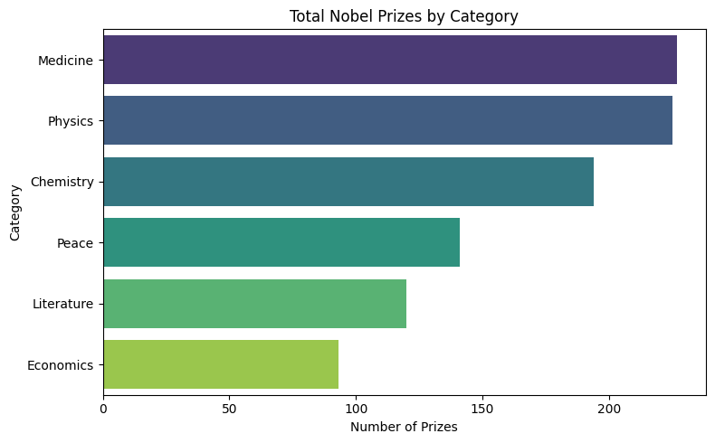
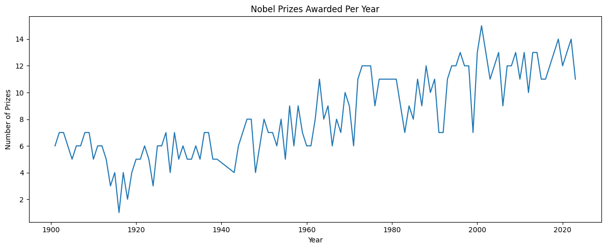
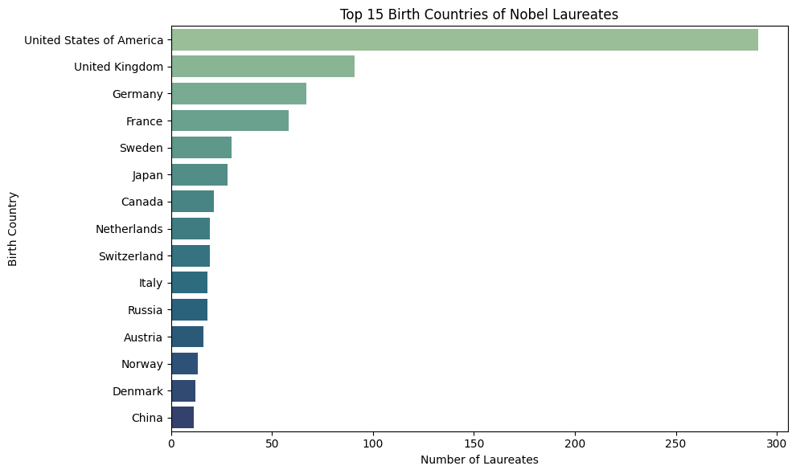
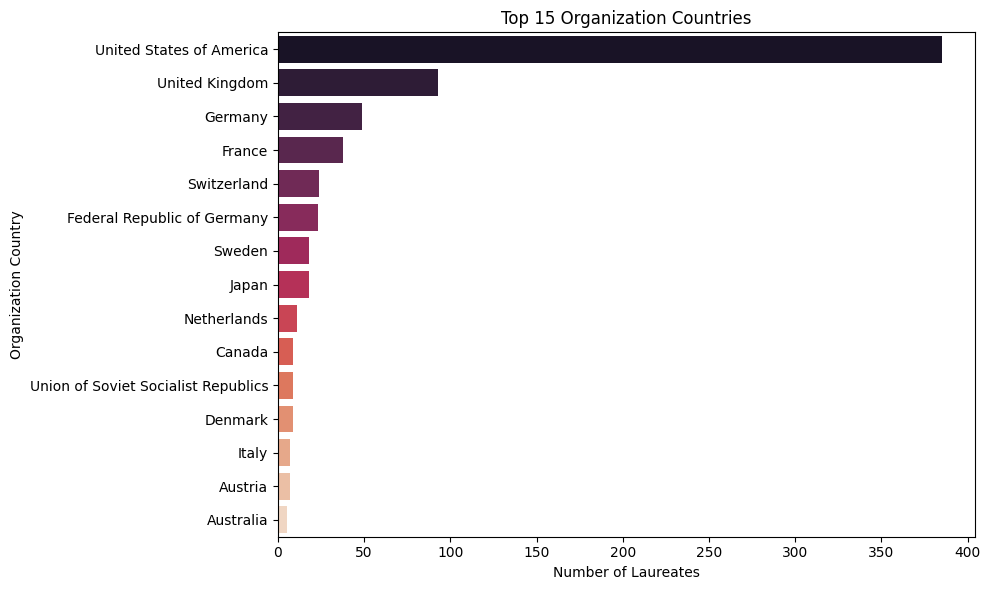
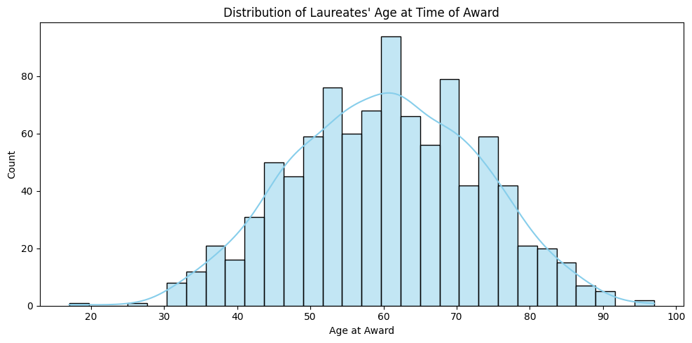
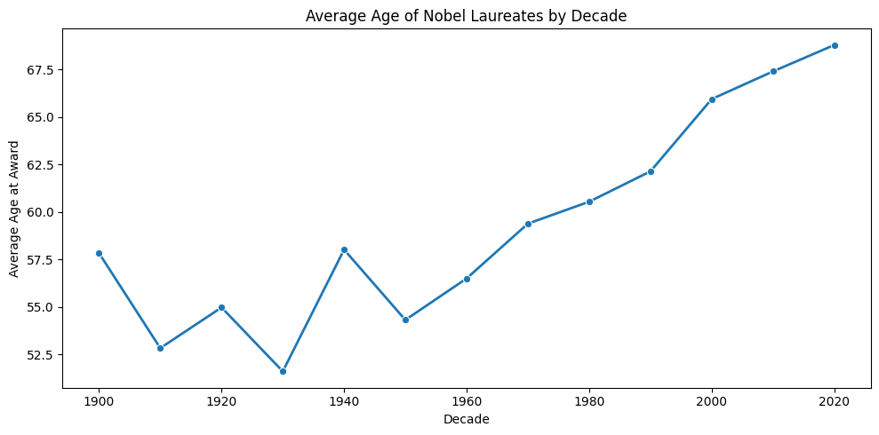
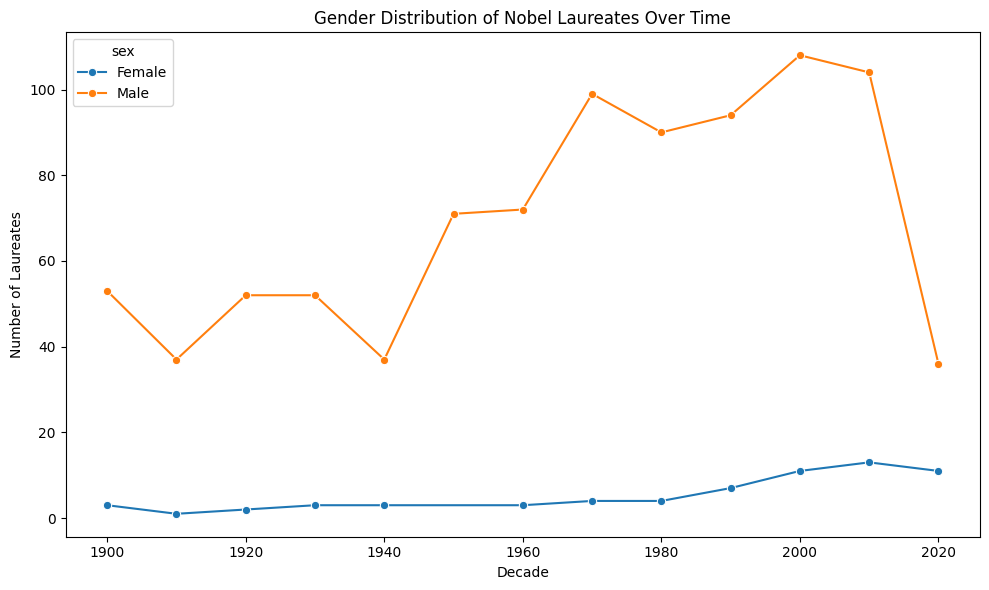

# 🏅 Nobel Prize Analysis (1901–2023)  
📊 **Advanced Python EDA | Feature Engineering | Visualization | Real-World Dataset**

---

## 🔍 Project Overview  
This project provides a deep exploration of the **Nobel Prize winners dataset** from 1901 to 2023. Through extensive feature engineering and insightful visualizations, we uncover trends related to **age, gender, geography, and prize categories**.  

---

## 📁 Dataset Summary  
- **Source**: Nobel Prize API via DataCamp  
- **Years Covered**: 1901–2023  
- **Total Laureates**: 1,000  
- **Fields**: Physics, Chemistry, Medicine, Peace, Literature, Economics  
- **Focus Areas**: Gender trends, age patterns, country affiliations, institutional dominance  

---

## 🧼 Data Cleaning Highlights  
- Converted `birth_date` and `death_date` to datetime  
- Created new features:  
  - `age_at_award`  
  - `is_alive`  
  - `decade_awarded`  
- Preserved historical nulls to retain all award entries  
- Checked for data types, null counts, and duplicates

---

## 📊 Key Visual Insights

### 🎯 Prize Distribution by Category

### 📈 Prizes Awarded Over Time

### 🌍 Top Countries by Birth & Organization

### 🎂 Average Age at Award

### 👩‍🔬 Gender Trends Over Time

---

## ❓ Business Questions Answered
- Which countries have the most Nobel laureates by birth and by affiliation?
- How has the gender distribution changed across decades and categories?
- What is the average age of laureates per category and over time?
- Who were the youngest and oldest Nobel winners?
- What are common themes in the award motivations?

---

## 🛠️ Tools & Technologies
- Python  
- Pandas  
- Seaborn & Matplotlib  
- Plotly  
- Jupyter Notebook  

---

## 🙋‍♂️ About Me

**Shareef Huzaifa**  
Aspiring Data Analyst passionate about storytelling through data and delivering insights from real-world datasets.

- 🔗 Website: [ShareefDev.com](https://www.ShareefDev.com)  
- 🔗 GitHub: [github.com/shareef99997](https://github.com/shareef99997)  
- 🔗 LinkedIn: [linkedin.com/in/shareef-ali](https://linkedin.com/in/shareef-ali)

---

